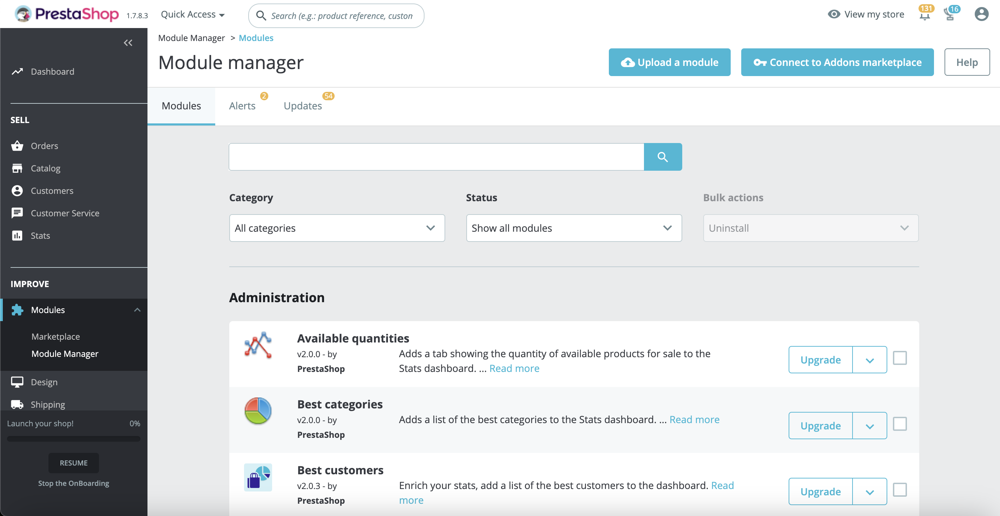
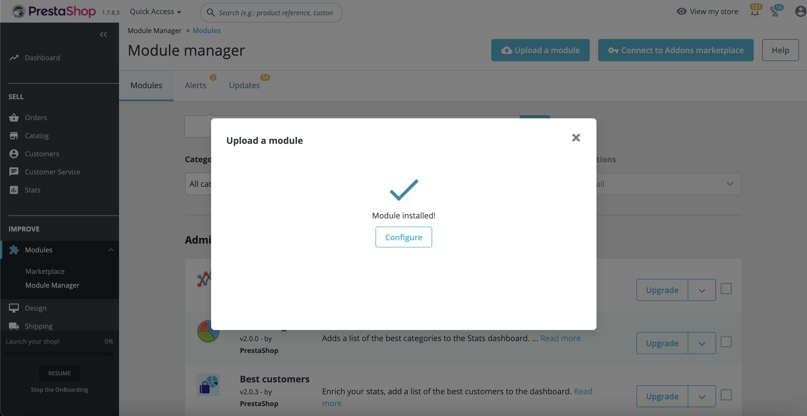
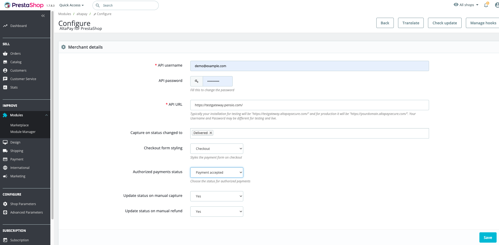
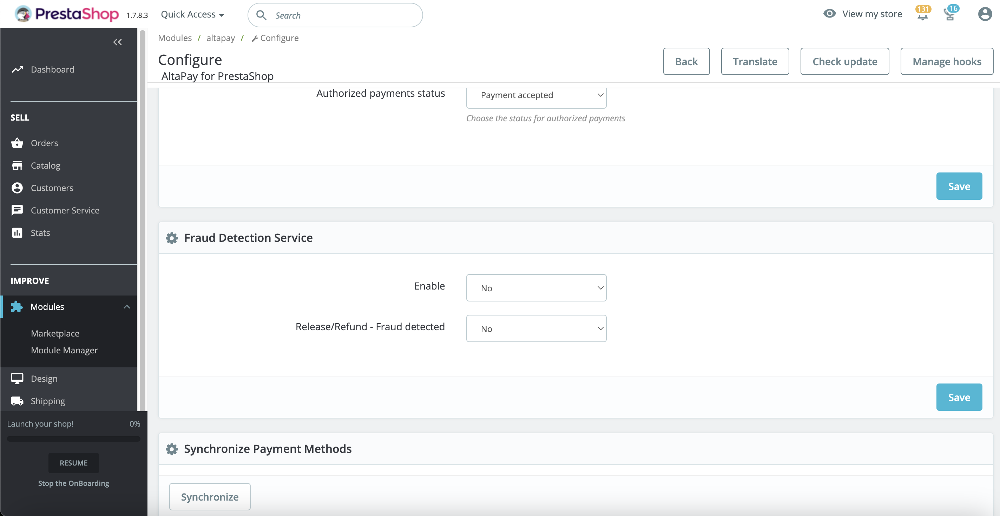
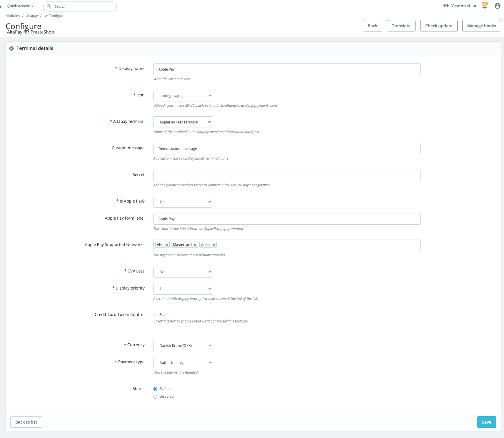
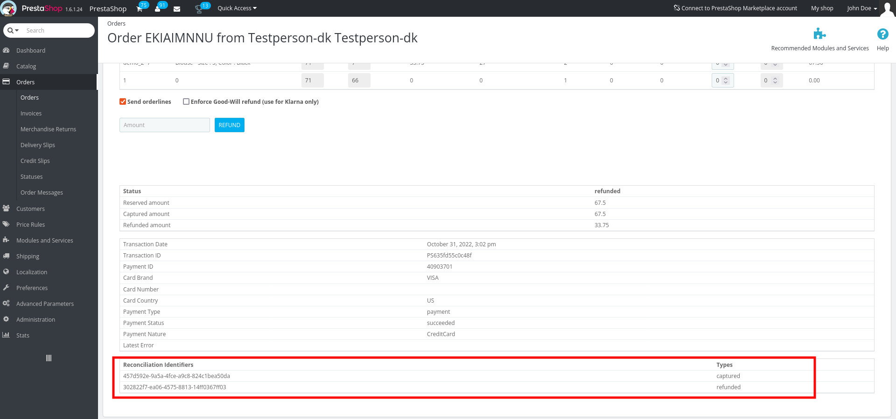
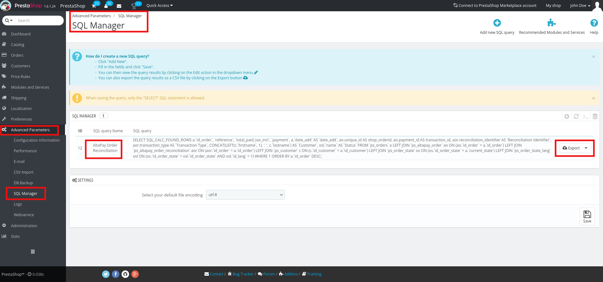

# AltaPay PrestaShop Plugin

AltaPay, headquartered in Denmark, is an internationally focused fintech company within payments with the mission to make payments less complicated. We help our merchants grow and expand their business across payment channels by offering a fully integrated seamless omni-channel experience for online, mobile and instore payments, creating transparency and reducing the need for manual tasks with one centralized payment platform.

AltaPay’s platform automizes, simplifies, and protects the transaction flow for shop owners and global retail and e-commerce companies, supporting and integrating smoothly into the major ERP systems. AltaPay performs as a Payment Service Provider operating under The Payment Card Industry Data Security Standard (PCI DSS).

## PrestaShop Payment plugin installation guide

Installing this plug-in will enable the web shop to handle card transactions through AltaPay's gateway.

**Table of Contents**

[Prerequisites](#prerequisites)

[Installation](#installation)

[Configuration](#configuration)

[Subscriptions](#subscriptions)

[Reconcile Orders](#reconcile-orders)

[Styling](#styling)

[Troubleshooting](#troubleshooting)

## Prerequisites

Before configuring the plugin, you need the below information. These can
be provided by AltaPay.

1.  AltaPay credentials:

-   Username

-   Password

2.  AltaPay gateway information:

-   Terminal

-   Gateway

## Installation

1. AltaPay only supports PrestaShop version 1.6.x
Go to ‘Modules and Services’ > ‘Modules And Services’ and click on “Add a new module” from the top-right corner.

   

2. Now click on “Choose a file” from the “Add a new module” tab and find the AltaPay.zip file. When you chose the file, click on “Upload the module”.

   

3. The module is now successfully imported. To finalize the installation, find the module in the list and click on “Install” to the right of the module.

   

4. A window will open - click on “Proceed with the installation”. When it’s done, a green bar will be visible and state that the module has been successfully installed.

   

## Configuration

1. Go to ‘Modules and Services’ > ‘Modules and Services’ and find the AltaPay PrestaShop module. This can be done by searching for ‘AltaPay’ or go to ‘Payment and Gateways’ and find the module. 
2. Click on ‘Configure’ for the module. 

   

3. If you wish to enable fraud detection service and release/refund if fraud is detected then refer to the below screenshot.

   

4. To synchronize the terminals with the gateway, click on the "Synchronize" button. This will fetch the latest terminals from the gateway and will automatically configure based on the store country.

   

5. Now, set up the terminals. At the bottom of the module configuration page, you will find a list of “Terminals”. There is a plus sign which you would need to click, to add a new terminal.

   

6. When setting up a terminal you must select the icon and name that is going to be shown in the check flow.  The currency must correspond with the currency on the terminal at AltaPay.  The payment type indicates if the money would be captured on reservation (‘Authorize and capture’) or the merchant would have to capture, when delivering the goods.

7. In the optional field 'Custom message', you can add custom message for the customers. e.g. guidelines from Danish Forbrugerombudsmanden.

8. In the optional field 'Secret', add the payment method secret as defined in the AltaPay payment gateway to enable checksum validation. To disable checksum validation leave it empty.

9. If the terminal is for Apple Pay payments, select **Yes** from the **Is Apple Pay?** dropdown.

   

   > Note
   >
   > Apple Pay functionality is supported with Prestashop 1.7 and above.

10. When you have set up your terminals you are ready to process transactions through AltaPay.

   

   


## Subscriptions

AltaPay plugin is compatible with the [Subscription Products | Recurring Payments Module](https://addons.prestashop.com/en/recurring-payment-subscription/49381-subscription-products-recurring-payments.html) to accept recurring payments.
* Please make sure the curl library is installed on your server to execute the cron tasks.
* Please remove the cron entry mentioned in [Subscription Products | Recurring Payments Module](https://addons.prestashop.com/en/recurring-payment-subscription/49381-subscription-products-recurring-payments.html) and instead insert one by AltaPay in your cron tasks manager for creating and scheduling automatic subscription orders and processing recurring payments.

   

> Note:
>
> Currently, AltaPay plugin supports recurring payments with the credit card terminal only.

## Reconcile Orders
In order to reconcile payments please follow the steps below:

1. Navigate to the PrestaShop **Admin** page.
2. Select **Orders** > **Orders** from the left menu.
3. Select the order you want to view.
4. Copy the **Reconciliation Identifier** from the **Payment Information** section.

   

Or export the order data to CSV from PrestaShop **SQL Manager** by clicking export button next to the **SQL query Name** `AltaPay Order Reconciliation`.
   
   
   
   


5. Navigate to AltaPay Gateway dashboard
6. Click on **FUNDING FILES** under **FINANCES** menu
7. Download the CSV file
8. Or you can find the payment in the transaction list, open the reconciliation file from there and download a csv file
9. Open the downloaded CSV file and match the **Reconciliation Identifier** with PrestaShop's **Reconciliation Identifier**.

**Sample AltaPay Gateway CSV:**


## Styling

- You can change/update the **Payment Form Page** by navigating to the below path:

    <https://github.com/AltaPay/plugin-prestashop/blob/main/views/templates/front/payment_form17.tpl>

- Use the below link to apply the **CSS** to the form page:

    <https://github.com/AltaPay/plugin-prestashop/blob/main/views/css/payment.css>

### Movic Theme Compatibility

   If you are using the Movic theme, search the below code in the file located at `root/modules/altapay/views/templates/front/payment_form17.tpl` 
   ```
   {extends file=$layout}
{block name='header'}
  {include file='checkout/_partials/header.tpl'}
   <link rel="stylesheet" href="{$css_dir}/theme.css" type="text/css" />
  {assign var="cart_info_path" value="module:altapay/views/templates/front/cart_info17.tpl"}
{/block}
   ```
   and replace it with below one
   ```
   <head>
      {block name='head'}
         {include file='_partials/head.tpl'}
      {/block}
   </head>

   <header id="header">
      {block name='header'}
         {include file='checkout/_partials/header.tpl'}
         {assign var="cart_info_path" value="module:altapay/views/templates/front/cart_info17.tpl"}
      {/block}
   </header>
   ```

## Troubleshooting

**PHP Warning: Input variables exceeded 1000. To increase the limit change max_input_vars in php.ini.**

- Open your php.ini file
- Edit the max_input_vars variable. This specifies the maximum number of variables that can be sent in a request. The default is 1000. Increase it to, say, 3000.
- Restart your server.

**Parameters: description/unitPrice/quantity are required for each orderline, but was not set for line: xxxx**
> The same problem as above. The request is being truncated because the number of variables are exceeding the max_input_vars limit.


## Providing error logs to support team


**In your Prestashop system, the ‘Transaction ID’ is the ID which matches the ‘Order ID’ within the AltaPay backend. Please do not use the Prestashop Order ID as reference ID when talking to AltaPay support.**


**You can find the CMS logs by following the below steps:**

From Admin Dashboard navigate to **"Advanced Parameters > Logs"** 

**Web server error logs**

**For Apache server** You can find it on **/var/log/apache2/error.log** 
 
**For Nginx** it would be **/var/log/nginx/error.log** 

**_Note: Your path may vary from the mentioned above._**


